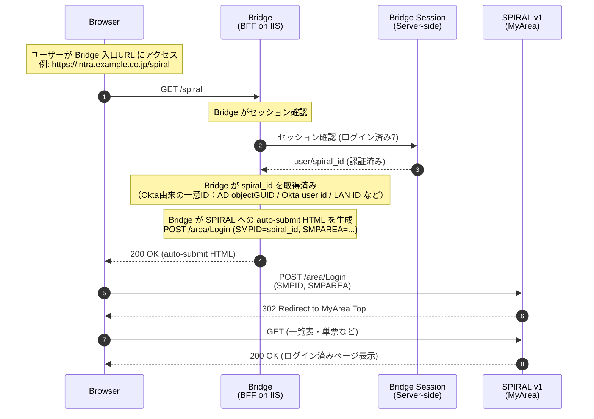
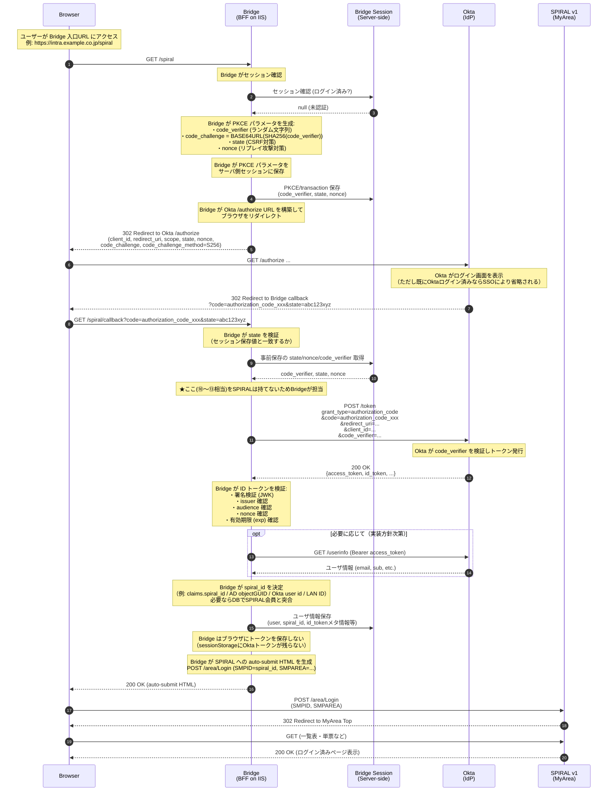
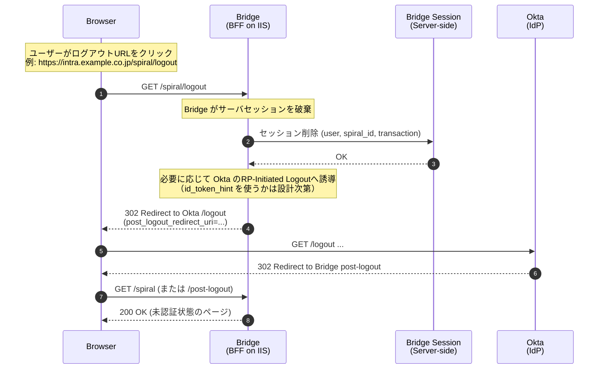

以下は、いただいた **JS版の文章構成をできるだけ保ったまま**、中身を **BFF（Bridge）版**に書き換えた案です。
ポイントは、

* **⑩〜⑬（token交換〜検証〜userinfo）はBridgeが担当**（SPIRALは担当できない）
* ブラウザ側は **トークンを保持しない**（sessionStorageにokta-token-storage等は基本出ない）
* 最後は **ブラウザがSPIRALへPOST**してSPIRAL側のCookieを確立する（ドメインの都合で必須）
* 社内利用（A想定）なら Bridge は社内IIS上でOK

を反映しています。

---

# OIDC 認証シーケンス図 (BFF/Bridge + Authorization Code + PKCE)

`Bridge`（社内IIS上のWebアプリ）における Okta の Authorization Code + PKCE フローのシーケンス図です。
**特徴:** ブラウザにトークンを保持せず、Bridge（サーバ）側で `code → token` 交換・検証を行い、SPIRALには「識別キー（SMPID）」でログインさせます。

> **重要:** OIDCの **⑩〜⑬相当（/token, トークン受領, 検証, /userinfo）はSPIRALでは実装できない**ため、Bridgeが担います。

---

## 認証済みの場合のフロー (Already Authenticated)

---

## 未認証からの認証フロー (Authentication Flow with PKCE)

---

## ログアウトフロー (Bridge主導 + Oktaログアウト)

BFF方式では「ブラウザのsessionStorageにトークンがない」ため、ログアウトは主に以下の2段階です。

* Bridgeのセッション破棄（Bridge側ログアウト）
* Oktaセッション破棄（必要なら）

> 補足：Oktaログアウトは運用要件次第です。
> 「Okta SSOは維持しつつ、SPIRALだけ抜けたい」なら Bridgeセッション破棄だけで十分なことも多いです。

---

## PKCE パラメータ詳細（BFF版）

| パラメータ                   | 説明                                    | 保存先（BFF）       |
| ----------------------- | ------------------------------------- | -------------- |
| `code_verifier`         | 暗号学的にランダムな文字列 (43-128文字)              | Bridgeサーバセッション |
| `code_challenge`        | `code_verifier` の SHA-256 を Base64URL | Oktaへ送信のみ      |
| `code_challenge_method` | `S256`                                | Oktaへ送信のみ      |
| `state`                 | CSRF 対策                               | Bridgeサーバセッション |
| `nonce`                 | IDトークンのリプレイ攻撃対策                       | Bridgeサーバセッション |

---

## JS版との違い（あなたの表の「BFF版」への置換）

| 項目                | JavaScript版 (index5.html) | **BFF/Bridge版（推奨）**                    |
| ----------------- | ------------------------- | -------------------------------------- |
| 実行環境              | ブラウザ                      | **サーバ（IIS上）**                          |
| 認証フロー             | Authorization Code + PKCE | **Authorization Code + PKCE**（サーバ実施）   |
| クライアント認証          | code_verifier（ブラウザ）       | **code_verifier（サーバ）**                 |
| トークン保存先           | sessionStorage            | **サーバセッション（ブラウザに残さない）**                |
| callback URL      | `/index5.html` 自身         | **`/spiral/callback`**（Bridgeのエンドポイント） |
| トークン取得            | ブラウザからOktaへPOST           | **BridgeがOktaへPOST**                   |
| SPIRALログイン        | ブラウザが直接POST               | **ブラウザがSPIRALへPOST（auto-submit HTML）** |
| SPIRAL側でOIDC(⑩〜⑬) | 不要                        | **不要（Bridgeで完結）**                      |
| セキュリティ説明          | トークンが端末に残る                | **端末にトークンを残さないので説明が通しやすい**             |

---

## URL 一覧（BFF/Bridge版の例）

| エンドポイント         | URL例                                               | 用途                             |
| --------------- | -------------------------------------------------- | ------------------------------ |
| Bridge入口        | `https://intra.example.co.jp/spiral`               | SPIRALへ入るための入口                 |
| Bridge callback | `https://intra.example.co.jp/spiral/callback`      | Oktaからの認可コード受信                 |
| Bridge logout   | `https://intra.example.co.jp/spiral/logout`        | Bridgeセッション破棄 + (任意でOktaログアウト) |
| Okta 認可         | `https://{oktaDomain}/oauth2/default/v1/authorize` | 認可リクエスト                        |
| Okta トークン       | `https://{oktaDomain}/oauth2/default/v1/token`     | トークン取得                         |
| Okta ログアウト      | `https://{oktaDomain}/oauth2/default/v1/logout`    | Oktaセッション終了                    |

---

## Okta アプリケーション設定（BFF/Bridge版）

Bridgeを使うには、Okta管理画面で以下のURIを登録します：

| 設定項目                   | 値（例）                                                     |
| ---------------------- | -------------------------------------------------------- |
| Sign-in redirect URIs  | `https://intra.example.co.jp/spiral/callback`            |
| Sign-out redirect URIs | `https://intra.example.co.jp/spiral`（または `/post-logout`） |

---

## 追加（SPIRAL連携での要点：SMPID）

BridgeがSPIRALへ送る `SMPID` は、**推測不能ID**（例：AD objectGUID / Okta user id）を推奨します。
メールアドレスをSMPIDにすると、ログインURL直アクセスの攻撃面が増えるため、避けた方が安全です。

---

必要なら、このドキュメントに合わせて **「全体フロー概要（flowchart TD）」もBFF版に置き換え**ます（JS版の図と同じ粒度で）。
また、実装がASP.NET Core前提なら、`/spiral` と `/spiral/callback` の疑似コード（コントローラ単位）まで続けて書けます。
