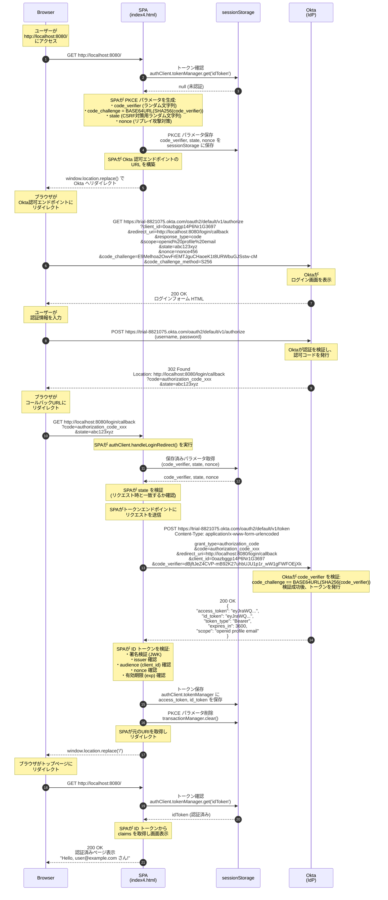
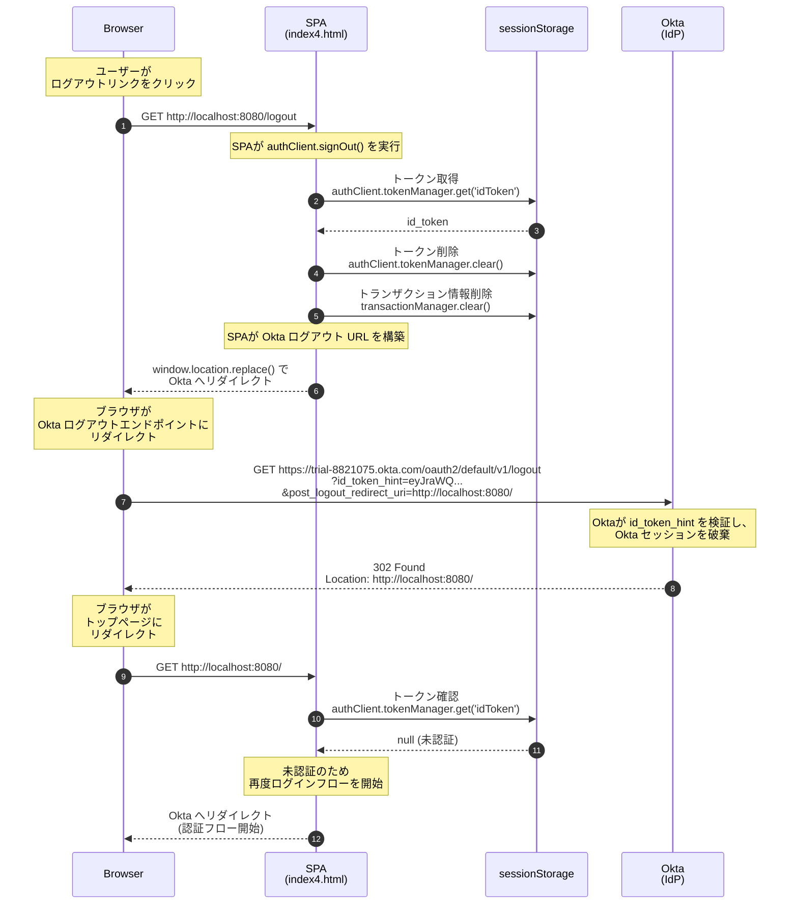

# OIDC 認証シーケンス図 (JavaScript + PKCE)

`public/index4.html` における Okta Auth JS SDK を使用した PKCE (Proof Key for Code Exchange) フローのシーケンス図です。

## 認証フロー (Authentication Flow with PKCE)



## ログアウトフロー (RP-Initiated Logout)



## PKCE パラメータ詳細

| パラメータ | 説明 | 例 |
|-----------|------|-----|
| `code_verifier` | クライアントが生成する暗号学的にランダムな文字列 (43-128文字) | `dBjftJeZ4CVP-mB92K27uhbUJU1p1r_wW1gFWFOEjXk` |
| `code_challenge` | `code_verifier` の SHA-256 ハッシュを Base64URL エンコードした値 | `E9Melhoa2OwvFrEMTJguCHaoeK1t8URWbuGJSstw-cM` |
| `code_challenge_method` | チャレンジ生成方法 (S256 = SHA-256) | `S256` |
| `state` | CSRF 対策用のランダム文字列 | `abc123xyz` |
| `nonce` | ID トークンのリプレイ攻撃対策用ランダム文字列 | `nonce456` |

## PHP版 (index.php) との違い

| 項目 | JavaScript版 (index4.html) | PHP版 (index.php) |
|------|---------------------------|-------------------|
| **実行環境** | ブラウザ (クライアントサイド) | サーバーサイド |
| **認証フロー** | Authorization Code + PKCE | Authorization Code (client_secret) |
| **クライアント認証** | code_verifier で検証 | client_secret で認証 |
| **トークン保存先** | sessionStorage | サーバーセッション ($_SESSION) |
| **コールバックパス** | `/login/callback` | `/authorization-code/callback` |
| **トークン取得** | ブラウザから直接 Okta に POST | PHP から Okta に POST |
| **セキュリティ** | PKCE で認可コード横取り攻撃を防止 | client_secret をサーバーで安全に保持 |

## 全体フロー概要

```mermaid
flowchart TD
    subgraph Browser["Browser"]
        A[ユーザーアクセス<br/>http://localhost:8080/]
    end

    subgraph SPA["SPA (index4.html)"]
        B{トークン<br/>存在?}
        C[PKCE パラメータ生成<br/>code_verifier, code_challenge,<br/>state, nonce]
        D[sessionStorage に保存]
        E[Okta URL 構築]
        K[handleLoginRedirect 実行]
        L[state/nonce 検証]
        M[トークン取得リクエスト]
        N[ID トークン検証]
        O[トークン保存]
        P[認証済み画面表示]
        Q[signOut 実行]
        R[トークン削除]
    end

    subgraph Storage["sessionStorage"]
        S[(code_verifier<br/>state<br/>nonce)]
        T[(access_token<br/>id_token)]
    end

    subgraph Okta["Okta (IdP)"]
        F[/authorize エンドポイント]
        G[ログイン画面]
        H[認可コード発行]
        I[/token エンドポイント]
        J[トークン発行]
        U[/logout エンドポイント]
        V[セッション破棄]
    end

    A --> B
    B -->|No| C
    C --> D
    D --> S
    D --> E
    E --> F
    F --> G
    G --> H
    H -->|code, state| K
    K --> L
    L --> M
    S --> M
    M --> I
    I --> J
    J --> N
    N --> O
    O --> T
    O --> P
    B -->|Yes| P
    T --> B

    P -->|ログアウト| Q
    Q --> R
    R --> U
    U --> V
    V --> A
```

## URL 一覧

| エンドポイント | URL | 用途 |
|---------------|-----|------|
| アプリケーション | `http://localhost:8080/` | トップページ |
| コールバック | `http://localhost:8080/login/callback` | 認可コード受信 |
| ログアウト | `http://localhost:8080/logout` | ログアウト処理開始 |
| Okta 認可 | `https://trial-8821075.okta.com/oauth2/default/v1/authorize` | 認可リクエスト |
| Okta トークン | `https://trial-8821075.okta.com/oauth2/default/v1/token` | トークン取得 |
| Okta ログアウト | `https://trial-8821075.okta.com/oauth2/default/v1/logout` | Okta セッション終了 |
