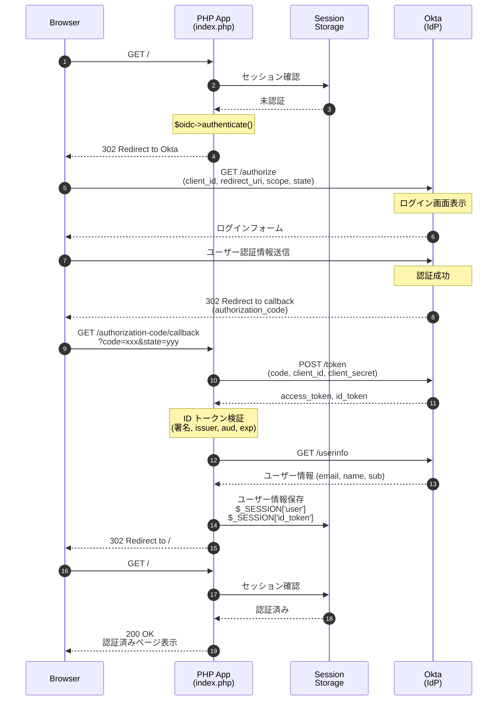
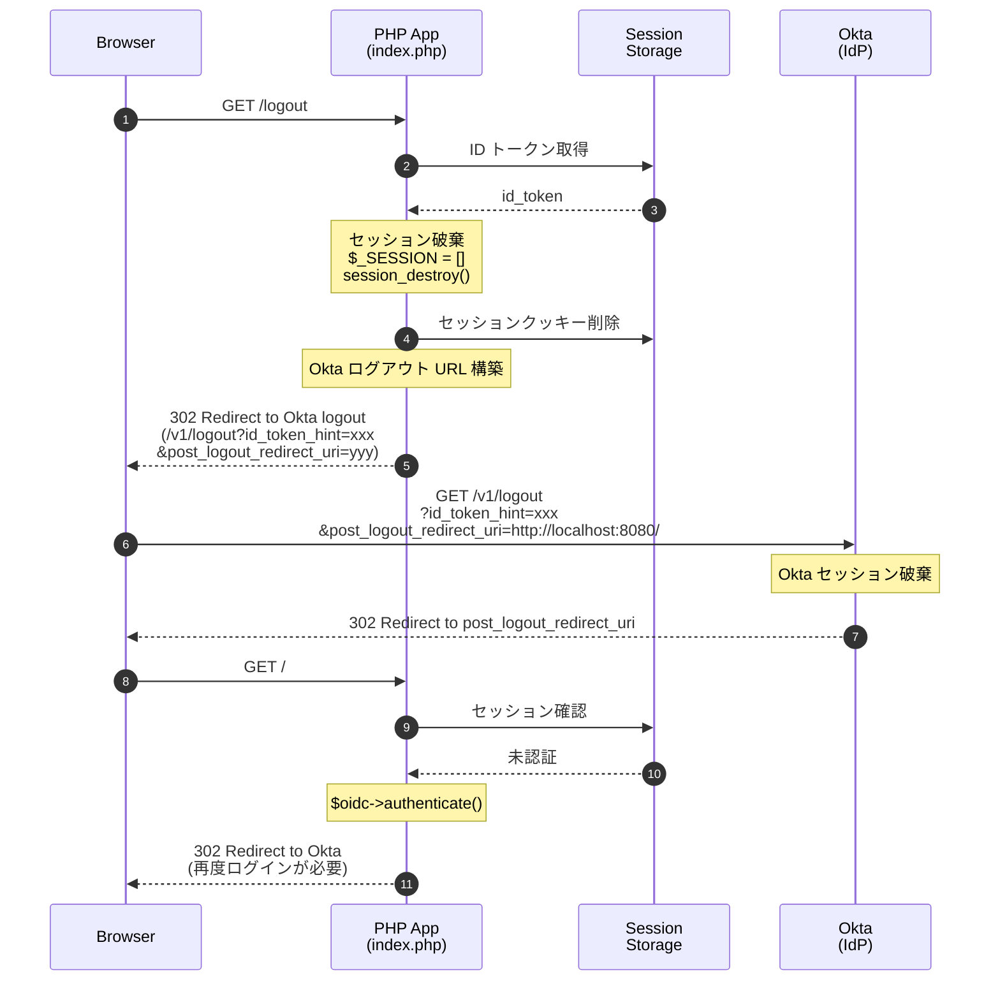
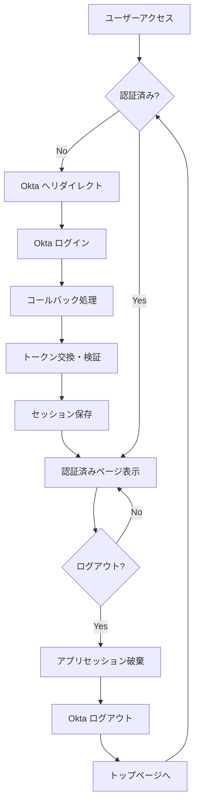

# OIDC 認証シーケンス図

## 認証フロー (Authentication Flow)

```mermaid
sequenceDiagram
    autonumber
    participant Browser as Browser
    participant App as PHP App<br/>(index.php)
    participant Session as Session<br/>Storage
    participant Okta as Okta<br/>(IdP)

    Browser->>App: GET /
    App->>Session: セッション確認
    Session-->>App: 未認証

    Note over App: $oidc->authenticate()
    App-->>Browser: 302 Redirect to Okta

    Browser->>Okta: GET /authorize<br/>(client_id, redirect_uri, scope, state)

    Note over Okta: ログイン画面表示
    Okta-->>Browser: ログインフォーム
    Browser->>Okta: ユーザー認証情報送信

    Note over Okta: 認証成功
    Okta-->>Browser: 302 Redirect to callback<br/>(authorization_code)

    Browser->>App: GET /authorization-code/callback<br/>?code=xxx&state=yyy

    App->>Okta: POST /token<br/>(code, client_id, client_secret)
    Okta-->>App: access_token, id_token

    Note over App: ID トークン検証<br/>(署名, issuer, aud, exp)

    App->>Okta: GET /userinfo
    Okta-->>App: ユーザー情報 (email, name, sub)

    App->>Session: ユーザー情報保存<br/>$_SESSION['user']<br/>$_SESSION['id_token']

    App-->>Browser: 302 Redirect to /
    Browser->>App: GET /
    App->>Session: セッション確認
    Session-->>App: 認証済み
    App-->>Browser: 200 OK<br/>認証済みページ表示
```

## ログアウトフロー (RP-Initiated Logout)

```mermaid
sequenceDiagram
    autonumber
    participant Browser as Browser
    participant App as PHP App<br/>(index.php)
    participant Session as Session<br/>Storage
    participant Okta as Okta<br/>(IdP)

    Browser->>App: GET /logout

    App->>Session: ID トークン取得
    Session-->>App: id_token

    Note over App: セッション破棄<br/>$_SESSION = []<br/>session_destroy()

    App->>Session: セッションクッキー削除

    Note over App: Okta ログアウト URL 構築
    App-->>Browser: 302 Redirect to Okta logout<br/>(/v1/logout?id_token_hint=xxx<br/>&post_logout_redirect_uri=yyy)

    Browser->>Okta: GET /v1/logout<br/>?id_token_hint=xxx<br/>&post_logout_redirect_uri=http://localhost:8080/

    Note over Okta: Okta セッション破棄

    Okta-->>Browser: 302 Redirect to post_logout_redirect_uri

    Browser->>App: GET /
    App->>Session: セッション確認
    Session-->>App: 未認証

    Note over App: $oidc->authenticate()
    App-->>Browser: 302 Redirect to Okta<br/>(再度ログインが必要)
```

## 全体フロー概要

```mermaid
flowchart TD
    A[ユーザーアクセス] --> B{認証済み?}
    B -->|No| C[Okta へリダイレクト]
    C --> D[Okta ログイン]
    D --> E[コールバック処理]
    E --> F[トークン交換・検証]
    F --> G[セッション保存]
    G --> H[認証済みページ表示]
    B -->|Yes| H

    H --> I{ログアウト?}
    I -->|Yes| J[アプリセッション破棄]
    J --> K[Okta ログアウト]
    K --> L[トップページへ]
    L --> B
    I -->|No| H
```
